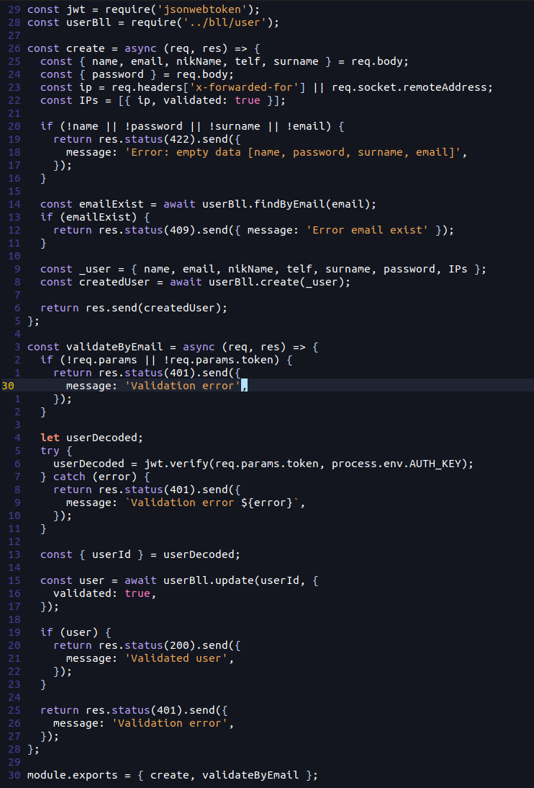

# Mjolnir for vim
Color scheme for vim.

## Install (vim 8+)
```bash
wget https://raw.githubusercontent.com/VikingCodeBlog/mjolnir-for-vim/main/berserker.vim && mkdir -p ~/.vim/colors/ && mv berserker.vim ~/.vim/colors/berserker.vim
```
Config in your .vimrc
```vim
set termguicolors
colorscheme berserker
```